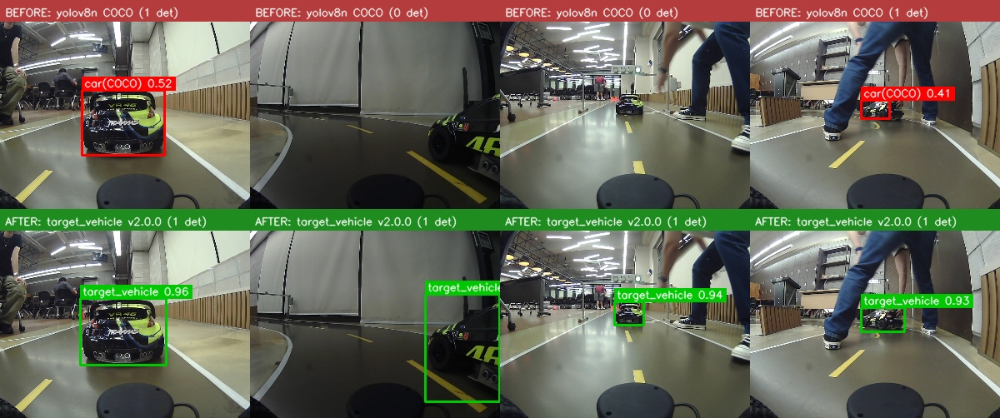
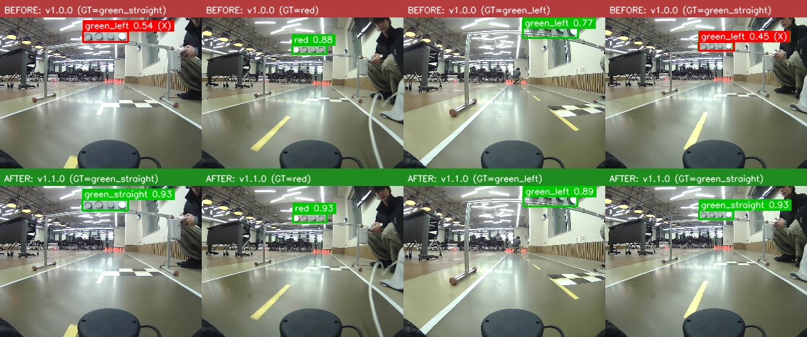

<div align="center">
<h1>yolo-V8-KMU-xycar 🏎️🚦</h1>
<p>국민대 자율주행 경진대회용 <a href="https://github.com/mastic-choi/KURiver-KMU-auto-contest">KURiver-KMU-auto-contest/track_drive</a>가
쓰는 두 인식 모델 — <b>방해차량 검출</b>과 <b>신호등 상태 분류</b> — 을 COCO/구버전
사전학습 그대로 쓰지 않고 대회 트랙 도메인에 맞춰 파인튜닝하는 저장소.</p>
</div>

## 하위 프로젝트

이 저장소는 서로 독립적인 두 YOLOv8 파인튜닝 프로젝트를 담고 있음 — 같은 bootstrap
방법론(자동검출 → 사람 검수 → 재학습 반복)을 공유하지만 데이터/클래스/방법은 각자
다름. 자세한 내용은 각 하위 폴더의 README 참고.

| 프로젝트 | 검출 대상 | 클래스 | 상태 |
|---|---|---|---|
| [`target_vehicle/`](target_vehicle/README.md) | 방해차량(vehA #46, TRAXXAS) | 1개 (`target_vehicle`) | [v1.2.0](https://github.com/mastic-choi/yolo-V8-KMU-xycar/releases/tag/v1.2.0) (NMS 내장 ONNX) |
| [`signal_state/`](signal_state/README.md) | 트랙 신호등 점등 상태 | 3개 (`red`/`green_straight`/`green_left`) | [v1.2.0](https://github.com/mastic-choi/yolo-V8-KMU-xycar/releases/tag/v1.2.0-signal_state) (NMS 내장 ONNX) |

---

## target_vehicle — Before / After

`track_drive`의 `yolo_vehicle.py`가 COCO 범용 `car` 클래스를 그대로 써서 신뢰도가
낮았던(실측 0.15~0.78, 평균 0.3대) 문제를 고치기 위해, 그 차량 한 대만 전용으로
검출하도록 파인튜닝. 같은 프레임 4장에 위=파인튜닝 전(COCO), 아래=파인튜닝 후
(v1.1.0)를 나란히 비교 — COCO는 4장 중 2장을 놓치거나 신뢰도가 낮은데, 파인튜닝
모델은 4장 전부 0.9대 신뢰도로 검출.



| Model | 학습 데이터 | epoch | 학습 시간 | mAP50 | mAP50-95 | Precision | Recall |
|:-----:|:-----------:|:-----:|:---------:|:-----:|:--------:|:---------:|:------:|
| [v1.0.0](https://github.com/mastic-choi/yolo-V8-KMU-xycar/releases/tag/v1.0.0) | seed_labeled 2,127장 | 80 (best@50) | 10.5분 | 0.995 | 0.974 | 1.0 | 1.0 |
| [v1.1.0](https://github.com/mastic-choi/yolo-V8-KMU-xycar/releases/tag/v1.1.0) | seed+round2 6,041장 | 139 (best@76) | 49분 | 0.995 | 0.985 :arrow_up: | 1.0 | 1.0 |
| **[v1.2.0](https://github.com/mastic-choi/yolo-V8-KMU-xycar/releases/tag/v1.2.0)** | v1.1.0과 동일 가중치 — **NMS 내장 ONNX**로 재export | — | — | 0.995 | 0.985 | 1.0 | 1.0 |

방법론, 데이터 소스, 알려진 함정은 → [`target_vehicle/README.md`](target_vehicle/README.md)

---

## signal_state — Before / After

기존 3클래스(`red`/`green_straight`/`green_left`) 모델이 `green_straight`와
`green_left`를 자주 혼동하는 문제를 고치기 위해, 신호를 하나의 상태로 고정해두고
새로 찍은 raw 프레임(6,888장)을 촬영 세션→클래스 매핑으로 라벨링해 데이터를
739장 → 7,377장(10배)으로 늘려 재학습. 위=v1.0.0(기존 739장), 아래=v1.1.0(보강
7,377장) — v1.0.0이 실제로 `green_straight`를 `green_left`로 오분류하던 프레임
2장(빨간 박스, 1번·4번 컬럼)이 v1.1.0에서 전부 정확히 고쳐짐.



| Model | 학습 데이터 | epoch | 학습 시간 | mAP50 | mAP50-95 | Precision | Recall |
|:-----:|:-----------:|:-----:|:---------:|:-----:|:--------:|:---------:|:------:|
| v1.0.0 (기존, 사람이 직접 라벨링) | 739장 | 50 (best@27) | 39분 | 0.995 | 0.807 | 0.995 | 0.996 |
| **v1.1.0** (raw데이터 세션 매핑 보강) | 7,377장 | 87 (best@67) | 37.7분 | 0.995 | **0.956** :arrow_up: | 1.0 | 1.0 |

방법론, 세션→클래스 매핑, 알려진 함정은 → [`signal_state/README.md`](signal_state/README.md)

---

## 레포 구성

```
target_vehicle/
  README.md                            # 방법론/데이터/알려진 함정
  BOOTSTRAP_ROUND2.md                   # 2차 라운드 실행 가이드
  notebooks/finetune_yolov8_local_rtx.ipynb
  scripts/                              # 스캔·큐레이션 스크립트
  data/seed_labeled/labels/             # 라벨만 커밋(이미지는 로컬)
  docs/before_after_montage.jpg
signal_state/
  README.md
  train.py
  scripts/                              # 스캔·데이터셋 병합·몽타주 스크립트
  data/seed_labeled/labels/             # 라벨만 커밋(이미지는 로컬)
  docs/before_after_montage.jpg
```

데이터셋 원본 이미지/가중치는 용량 문제로 이 레포에 포함하지 않음(`.gitignore`
참고) — 라벨 텍스트와 스크립트, 문서만 커밋.

## 관련 링크

- 실차 배포 대상: [mastic-choi/KURiver-KMU-auto-contest](https://github.com/mastic-choi/KURiver-KMU-auto-contest) (`track_drive` 패키지)
- 같은 방법론을 차선 인식에 적용한 자매 프로젝트: [TwinLiteNet-KMU-finetune](https://github.com/mastic-choi/TwinLiteNet-KMU-finetune)
